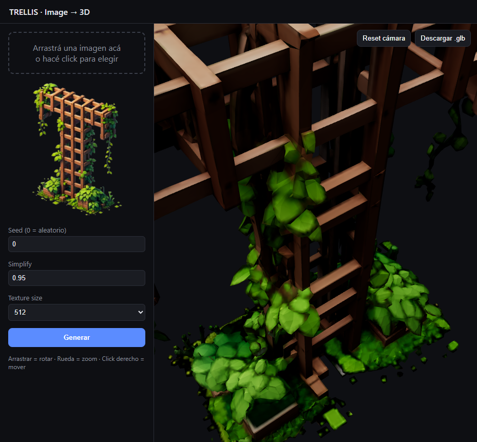

<div align="center">

# 🛰️ TRELLIS API — Turn a flat image into a game-ready 3D model

**One image in → one textured `.glb` out.** A self-contained, GPU-powered Docker service that
converts 2D concept art into 3D models, built to feed the asset pipeline of
[**KOLONEX**](https://kolonex.net) — a real-time 4X space-empire strategy game.

[](https://hub.docker.com/r/kolonex/trellis-api)
[](https://hub.docker.com/r/kolonex/trellis-api)
[](https://github.com/microsoft/TRELLIS)
[](https://kolonex.net)



*English · [Español ↓](#-español)*

</div>

---

## 🎮 Why this exists

[**KOLONEX**](https://kolonex.net) is a browser-based, real-time **4X space strategy** game — colonize
procedurally-generated 3D planets, build your economy, research 40 technologies, forge alliances, and
wage fleet warfare. A universe like that is *hungry* for 3D content: ships, structures, props, planetary
buildings.

Modeling each one by hand doesn't scale. So we wired up **TRELLIS** — Microsoft's state-of-the-art
image-to-3D model — behind a clean HTTP API and a live three.js viewer, packaged into a **single Docker
image that runs 100% offline**. Drop in a piece of concept art, get back a textured `.glb` in **~28
seconds**. That's the machine that turns ideas into in-game assets.

> **⭐ Star this repo if you build with it — and come [play KOLONEX](https://kolonex.net) (free, early access).**

---

## ✨ Highlights

- 🖼️ **Image → textured `.glb`** in one request, powered by [microsoft/TRELLIS](https://github.com/microsoft/TRELLIS).
- 📦 **Fully self-contained & offline.** Models (TRELLIS-image-large + DINOv2 + rembg) and the three.js
  frontend are **baked into the image**. Verified with `docker run --network none`.
- 🌐 **Built-in viewer.** A dependency-free three.js frontend — rotate, zoom, pan — served by the same container.
- ⚡ **Fast.** ~28 s per model on an RTX 3090; GLB ≈ 2.5 MB with textures.
- 🧪 **Testable without a GPU.** The whole API is covered by tests that run on any laptop via a `FakeBackend`.
- 🔒 **Hardened.** Path-traversal-safe IDs, upload size limits, a blocking mutex so the GPU serves one job at a time.

---

## 🚀 Quick start

```bash
docker run --gpus all -p 8000:8000 -v trellis-outputs:/outputs kolonex/trellis-api:latest
```

Open **http://localhost:8000** for the viewer, or call the API directly:

```bash
# JSON response with a download URL
curl -F file=@ship.png -F seed=42 http://localhost:8000/generate

# stream the GLB binary straight back
curl -F file=@ship.png -F inline=true http://localhost:8000/generate -o ship.glb
```

Custom host port + a persistent local folder (container always listens on `8000`):

```bash
docker run --gpus all -p 5081:8000 -v /path/to/outputs:/outputs kolonex/trellis-api:latest
# → http://localhost:5081
```

**Requirements:** NVIDIA GPU with **≥16 GB VRAM**, CUDA-11.8-compatible drivers, and the
[NVIDIA Container Toolkit](https://docs.nvidia.com/datacenter/cloud-native/container-toolkit/latest/install-guide.html).
The image is compiled for `TORCH_CUDA_ARCH_LIST=8.6` (Ampere — RTX 3090 / 40xx).

---

## 🧩 API

| Method | Path | Description |
|---|---|---|
| `GET`    | `/`               | three.js frontend |
| `GET`    | `/health`         | model status + free VRAM |
| `POST`   | `/generate`       | multipart `file` + params → JSON `{url,...}` or GLB (`inline=true`) |
| `POST`   | `/generate/json`  | `{ image_base64, ... }` → same |
| `GET`    | `/files/{id}.glb` | download a model |
| `DELETE` | `/files/{id}.glb` | delete a model |

**Params:** `seed` (0 = random), `ss_steps`, `ss_cfg_strength`, `slat_steps`, `slat_cfg_strength`,
`simplify` (0..1), `texture_size` (512 / 1024 / 2048), `inline` (bool).

---

## 🏗️ How the image is built

The `Dockerfile` is a single, reproducible recipe on top of
`nvidia/cuda:11.8.0-cudnn8-devel-ubuntu22.04` (it ships `nvcc`, needed to compile TRELLIS's CUDA
extensions). The pipeline:

1. **System deps** — Python 3.10, `build-essential`, `ninja`, GL libs.
2. **Torch first** — `torch==2.4.0 + torchvision==0.19.0` on the **cu118** index, so every native
   extension that follows links against the right CUDA.
3. **Clone TRELLIS + compile extensions** at build time (`spconv`, `diffoctreerast`, `mipgaussian`, …).
4. **Fix the extensions `setup.sh` gets wrong** for a pip-installed cu118 torch (`xformers`, `kaolin`,
   `nvdiffrast`, `plyfile`, `utils3d`) — see [war stories below](#-difficulties-overcome).
5. **Install the API** (FastAPI + uvicorn).
6. **Bake the weights** — `TRELLIS-image-large`, the DINOv2 encoder (~1.1 GB) and the rembg `u2net`
   model, so first generation needs zero internet.
7. **GPU-free build guards** — `importlib.util.find_spec` checks that fail the build *immediately* if
   any extension didn't land, instead of blowing up at runtime.

```bash
# build (first build compiles CUDA extensions + bakes models: ~40–60 min, ~16 GB image)
docker build -t trellis-api ./trellis-docker
# or: cd trellis-docker && docker compose build
```

---

## 🧨 Difficulties overcome

Getting TRELLIS to build **headless, GPU-less, and reproducibly inside `docker build`** meant defusing a
string of subtle traps. Each is documented inline in the `Dockerfile`; the highlights:

| # | The trap | The fix |
|---|----------|---------|
| 1 | **`dash` swallows args.** Docker `RUN` uses `/bin/sh` (dash); `. ./setup.sh --flags` sources the script but drops its arguments, so it only printed usage. | Run it under **`bash ./setup.sh …`**. |
| 2 | **Silent extension skip.** `setup.sh` gates every GPU-extension install on `torch.cuda.is_available()` — which is **False during `docker build`** (no GPU), so all extensions were quietly skipped. | `sed`-rewrite the check to `torch.version.cuda is not None` — truthy at build time, compiles for the target arch without a GPU. |
| 3 | **flash-attn from source.** Its CUDA path builds from source here — brutally slow and memory-hungry. | Switch to the **xformers** attention backend (prebuilt wheel). |
| 4 | **Version-suffix mismatch.** `setup.sh`'s `case 2.4.0)` never matches because the pip version is `2.4.0+cu118`, so xformers wasn't installed. | Install the correct **cu118 xformers wheel** explicitly. |
| 5 | **kaolin wheel mismatch.** `setup.sh` sends torch 2.4.0 to **cu121** wheels — incompatible with our cu118 torch. | Use NVIDIA's **cu118 kaolin** wheels for torch 2.4.0. |
| 6 | **nvdiffrast isn't on PyPI** and its `setup.py` imports torch at build time. | Clone it and `pip install --no-build-isolation`. |
| 7 | **Ancient setuptools.** The base image's `setuptools 59.6.0` can't parse some `pyproject.toml` `[project].name` → packages install as `UNKNOWN-0.0.0` and aren't importable. | Upgrade **`setuptools>=70`** before those installs. |
| 8 | **Missing runtime deps.** `plyfile` (gaussian repr) and `moderngl` (utils3d) aren't pulled by `setup.sh --basic`. | Install them explicitly. |
| 9 | **utils3d builds as UNKNOWN** under pip and isn't importable. | Put it on **`PYTHONPATH`** (pinned commit) like the `trellis` package, not via pip. |
| 10 | **Package shadowing.** TRELLIS ships `/opt/TRELLIS/app.py` (its Gradio demo) which shadows *our* `app` package if the CWD is `/opt/TRELLIS`. | Keep **`WORKDIR /app`** so our `app.api:app` wins. |
| 11 | **transformers ↔ huggingface_hub clobber.** Pinning `pillow`/`huggingface_hub` in our API reqs downgraded the coherent versions `setup.sh` installed and broke `transformers` imports. | Leave them **unpinned** — keep the versions already baked in. |

The payoff: a build that either **produces a fully working image or fails loudly at build time** — never a
container that looks fine until the first generation crashes.

---

## 🧠 Architecture

TRELLIS is isolated behind a small `Backend` protocol (`load()` / `run()`). A `PipelineManager` wraps any
backend with an `asyncio.Lock` (one GPU job at a time), timing, and persistence. The API (`create_app`
factory) and `storage.py` **know nothing about torch or CUDA**, so they're tested anywhere with a
`FakeBackend`. Only `TrellisBackend` and `docker build` need a GPU.

```
app/
├── schemas.py    # Pydantic v2 request/response validation
├── storage.py    # the only place that touches .glb paths (traversal-safe job_id)
├── pipeline.py   # Backend protocol · PipelineManager (mutex) · FakeBackend · TrellisBackend
├── api.py        # create_app factory + endpoints
└── web/          # dependency-free three.js viewer (vendored, no build step)
```

**Dev tests (no GPU, no torch):**

```bash
cd trellis-docker
python -m venv .venv && . .venv/Scripts/activate   # bash: source .venv/bin/activate
pip install -r requirements-dev.txt
pytest
```

---

## ⚙️ Configuration

Generated models are written to **`/outputs`** — mount a volume there to keep them.

| Env var | Default | Description |
|---|---|---|
| `OUTPUT_DIR`    | `/outputs` | where `.glb` files are stored |
| `MAX_UPLOAD_MB` | `10`       | max input image size (MB) |
| `ATTN_BACKEND`  | `xformers` | attention backend (`xformers` \| `flash-attn`) |
| `SPCONV_ALGO`   | `native`   | sparse-conv algorithm |

---

## 📄 License & credits

This wrapper — API, viewer, and Docker packaging — is released under the [MIT License](LICENSE) and is
part of the [KOLONEX](https://kolonex.net) toolchain. It is built on
[microsoft/TRELLIS](https://github.com/microsoft/TRELLIS); the TRELLIS code and model weights remain
subject to their own respective licenses.

<div align="center">

### 🎮 [Play KOLONEX — free, in early access →](https://kolonex.net)

</div>

---
---

<a name="-español"></a>

<div align="center">

# 🛰️ TRELLIS API — Convertí una imagen plana en un modelo 3D listo para el juego

**Una imagen entra → un `.glb` texturizado sale.** Un servicio Docker autocontenido y acelerado por GPU
que transforma arte conceptual 2D en modelos 3D, creado para alimentar el pipeline de assets de
[**KOLONEX**](https://kolonex.net) — un juego de estrategia espacial 4X en tiempo real.

*[English ↑](#️-trellis-api--turn-a-flat-image-into-a-game-ready-3d-model) · Español*

</div>

## 🎮 Por qué existe

[**KOLONEX**](https://kolonex.net) es un **4X de estrategia espacial en tiempo real** que corre en el
navegador: colonizá planetas 3D procedurales, desarrollá tu economía, investigá 40 tecnologías, formá
alianzas y peleá con flotas. Un universo así **devora contenido 3D**: naves, estructuras, edificios,
props.

Modelar cada uno a mano no escala. Así que conectamos **TRELLIS** —el modelo image-to-3D de Microsoft—
detrás de una API HTTP limpia y un visor three.js en vivo, empaquetado en **una sola imagen Docker que
corre 100% offline**. Metés una imagen conceptual y recibís un `.glb` texturizado en **~28 segundos**. Es
la máquina que convierte ideas en assets del juego.

> **⭐ Dale una estrella si construís con esto — y vení a [jugar KOLONEX](https://kolonex.net) (gratis, acceso anticipado).**

## ✨ Lo destacado

- 🖼️ **Imagen → `.glb` texturizado** en una sola request, con [microsoft/TRELLIS](https://github.com/microsoft/TRELLIS).
- 📦 **Autocontenido y offline.** Modelos (TRELLIS-image-large + DINOv2 + rembg) y el frontend three.js
  **horneados en la imagen**. Verificado con `docker run --network none`.
- 🌐 **Visor incluido.** Frontend three.js sin dependencias — rotar, zoom, pan — servido por el mismo container.
- ⚡ **Rápido.** ~28 s por modelo en una RTX 3090; GLB ≈ 2,5 MB con texturas.
- 🧪 **Testeable sin GPU.** Toda la API se cubre con tests que corren en cualquier laptop vía un `FakeBackend`.
- 🔒 **Endurecido.** IDs a prueba de path-traversal, límite de tamaño de subida, y un mutex bloqueante para que la GPU atienda un job a la vez.

## 🚀 Inicio rápido

```bash
docker run --gpus all -p 8000:8000 -v trellis-outputs:/outputs kolonex/trellis-api:latest
```

Abrí **http://localhost:8000** para el visor, o llamá la API directamente:

```bash
# respuesta JSON con URL de descarga
curl -F file=@nave.png -F seed=42 http://localhost:8000/generate

# el binario GLB directo
curl -F file=@nave.png -F inline=true http://localhost:8000/generate -o nave.glb
```

Puerto de host propio + carpeta local persistente (el container siempre escucha en `8000`):

```bash
docker run --gpus all -p 5081:8000 -v /ruta/local/outputs:/outputs kolonex/trellis-api:latest
# → http://localhost:5081
```

**Requisitos:** GPU NVIDIA con **≥16 GB de VRAM**, drivers compatibles con CUDA 11.8, y el
[NVIDIA Container Toolkit](https://docs.nvidia.com/datacenter/cloud-native/container-toolkit/latest/install-guide.html).
La imagen se compila para `TORCH_CUDA_ARCH_LIST=8.6` (Ampere — RTX 3090 / 40xx).

## 🏗️ Cómo se construye la imagen

El `Dockerfile` es una receta reproducible sobre `nvidia/cuda:11.8.0-cudnn8-devel-ubuntu22.04` (trae
`nvcc`, necesario para compilar las extensions CUDA de TRELLIS):

1. **Deps de sistema** — Python 3.10, `build-essential`, `ninja`, libs GL.
2. **Torch primero** — `torch==2.4.0 + torchvision==0.19.0` del índice **cu118**, para que cada extension
   nativa que sigue enlace contra la CUDA correcta.
3. **Clonar TRELLIS + compilar extensions** en build time (`spconv`, `diffoctreerast`, `mipgaussian`, …).
4. **Arreglar las extensions que `setup.sh` maneja mal** para un torch cu118 instalado por pip
   (`xformers`, `kaolin`, `nvdiffrast`, `plyfile`, `utils3d`) — ver [las batallas abajo](#-dificultades-sorteadas).
5. **Instalar la API** (FastAPI + uvicorn).
6. **Hornear los pesos** — `TRELLIS-image-large`, el encoder DINOv2 (~1,1 GB) y el modelo rembg `u2net`,
   para que la primera generación no necesite internet.
7. **Guards sin GPU** — chequeos con `importlib.util.find_spec` que fallan el build *de inmediato* si
   alguna extension no quedó, en vez de explotar en runtime.

```bash
# build (el primero compila extensions CUDA + hornea modelos: ~40–60 min, imagen ~16 GB)
docker build -t trellis-api ./trellis-docker
```

## 🧨 Dificultades sorteadas

Lograr que TRELLIS compilara **sin cabeza, sin GPU y de forma reproducible dentro de `docker build`**
implicó desactivar una serie de trampas sutiles. Cada una está documentada en el `Dockerfile`:

| # | La trampa | La solución |
|---|-----------|-------------|
| 1 | **`dash` se come los argumentos.** El `RUN` de Docker usa `/bin/sh` (dash); `. ./setup.sh --flags` sourcea el script pero pierde sus argumentos → solo imprimía el uso. | Correrlo bajo **`bash ./setup.sh …`**. |
| 2 | **Skip silencioso de extensions.** `setup.sh` condiciona cada install de extension GPU a `torch.cuda.is_available()` — **False durante `docker build`** (no hay GPU) → todas se saltaban sin avisar. | Reescribir el chequeo con `sed` a `torch.version.cuda is not None` — truthy en build, compila para la arch objetivo sin GPU. |
| 3 | **flash-attn desde fuente.** Su path CUDA compila desde fuente acá — lentísimo y comelón de RAM. | Cambiar al backend de atención **xformers** (wheel precompilado). |
| 4 | **Mismatch de sufijo de versión.** El `case 2.4.0)` de `setup.sh` nunca matchea porque la versión pip es `2.4.0+cu118` → xformers no se instalaba. | Instalar el **wheel cu118 de xformers** explícitamente. |
| 5 | **Wheel de kaolin equivocado.** `setup.sh` manda torch 2.4.0 a wheels **cu121** — incompatibles con nuestro torch cu118. | Usar los wheels **cu118 de kaolin** de NVIDIA para torch 2.4.0. |
| 6 | **nvdiffrast no está en PyPI** y su `setup.py` importa torch en build time. | Clonarlo e instalar con `pip install --no-build-isolation`. |
| 7 | **setuptools viejo.** El `setuptools 59.6.0` de la imagen base no parsea ciertos `pyproject.toml` → paquetes instalados como `UNKNOWN-0.0.0`, no importables. | Actualizar **`setuptools>=70`** antes de esos installs. |
| 8 | **Deps de runtime faltantes.** `plyfile` (repr gaussiana) y `moderngl` (utils3d) no los trae `setup.sh --basic`. | Instalarlos explícitamente. |
| 9 | **utils3d se instala como UNKNOWN** bajo pip y no es importable. | Ponerlo en el **`PYTHONPATH`** (commit fijado) como el paquete `trellis`, no vía pip. |
| 10 | **Shadowing de paquetes.** TRELLIS trae `/opt/TRELLIS/app.py` (su demo Gradio) que tapa *nuestro* paquete `app` si el CWD es `/opt/TRELLIS`. | Mantener **`WORKDIR /app`** para que gane nuestro `app.api:app`. |
| 11 | **Choque transformers ↔ huggingface_hub.** Pinear `pillow`/`huggingface_hub` en nuestros reqs bajaba las versiones coherentes que instaló `setup.sh` y rompía los imports de `transformers`. | Dejarlos **sin pin** — conservar las versiones ya horneadas. |

El resultado: un build que **produce una imagen 100% funcional o falla ruidosamente en build time** —
nunca un container que parece sano hasta que la primera generación revienta.

## 🧠 Arquitectura

TRELLIS queda aislado detrás de un `Backend` protocol (`load()` / `run()`). Un `PipelineManager` envuelve
cualquier backend con un `asyncio.Lock` (un job de GPU a la vez), timing y persistencia. La API (factory
`create_app`) y `storage.py` **no conocen torch ni CUDA**, así que se testean en cualquier lado con un
`FakeBackend`. Solo `TrellisBackend` y el `docker build` requieren GPU.

```
app/
├── schemas.py    # validación Pydantic v2 de request/response
├── storage.py    # único lugar que toca paths .glb (job_id anti-traversal)
├── pipeline.py   # Backend protocol · PipelineManager (mutex) · FakeBackend · TrellisBackend
├── api.py        # factory create_app + endpoints
└── web/          # visor three.js sin dependencias (vendored, sin build)
```

**Tests de desarrollo (sin GPU, sin torch):**

```bash
cd trellis-docker
python -m venv .venv && . .venv/Scripts/activate   # bash: source .venv/bin/activate
pip install -r requirements-dev.txt
pytest
```

## 📄 Licencia y créditos

Este wrapper —API, visor y empaquetado Docker— se publica bajo la [Licencia MIT](LICENSE) y es parte del
toolchain de [KOLONEX](https://kolonex.net). Está construido sobre
[microsoft/TRELLIS](https://github.com/microsoft/TRELLIS); el código y los pesos de TRELLIS siguen
sujetos a sus respectivas licencias.

<div align="center">

### 🎮 [Jugá KOLONEX — gratis, en acceso anticipado →](https://kolonex.net)

</div>
